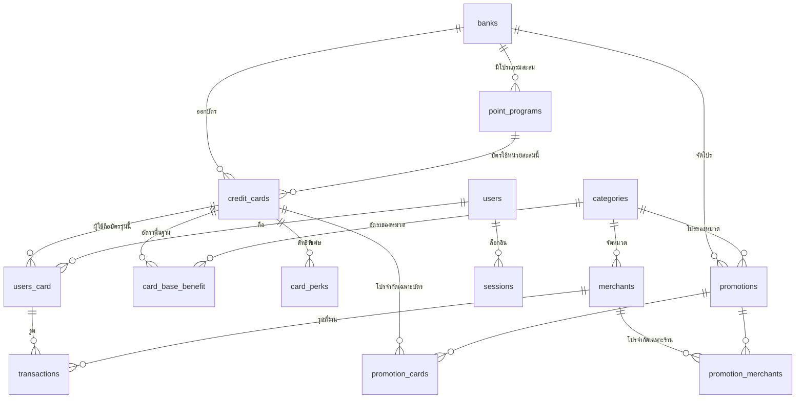

# Data Model — Cardly

เอกสารนี้บอก **ความหมาย** ของแต่ละตาราง ไม่ใช่โครงสร้าง

- โครงสร้างจริง (คอลัมน์ · ชนิดข้อมูล · index) → `prisma/schema.prisma` เป็น source of truth เสมอ
- เอกสารนี้ตอบ: แถวหนึ่งของตารางนี้หมายถึงอะไร · `NULL` แปลว่าอะไร · ทำไมต้องมีตารางนี้ · กรอกผิดแล้วเกิดอะไร

> ⚠️ ไม่มีโฟลเดอร์ `prisma/migrations/` — schema ปัจจุบัน introspect มาจาก Supabase
> การแก้จึงเป็น **แก้ที่ Supabase → `npx prisma db pull` → `npx prisma generate`**
> ไม่ใช่ `prisma migrate dev` ตามที่ `CLAUDE.md` เขียนไว้ (ข้อนี้ยังไม่ได้ตัดสินว่าจะย้ายมาใช้ migration file หรือไม่)

**สถานะ**
| | ความหมาย |
|---|---|
| ✅ | มีอยู่จริงใน DB วันนี้ |
| 🔧 | ออกแบบไว้แล้ว ยังไม่ได้สร้าง |
| ⚠️ | มีอยู่จริง แต่มีปัญหาที่รู้ตัวแล้ว |

---

## แผนผัง



---

# กลุ่ม 1 · แคตตาล็อกบัตร

ข้อมูล **ระดับผลิตภัณฑ์** — เป็นความจริงของบัตรรุ่นนั้นเหมือนกันทุกคนที่ถือ ไม่ผูกกับ user คนไหน

## `banks` ✅

หนึ่งแถว = หนึ่งสถาบันผู้ออกบัตร

`id` เป็น **VarChar ที่คนอ่านออก** ไม่ใช่ UUID (`KBANK`, `SCB`, `KTC`, `UOB`, `BBL`, `BAY`, `AEON`) — ตั้งใจให้ debug ง่ายและอ่าน log รู้เรื่อง

| id | name_th | color | initial |
|---|---|---|---|
| `KBANK` | ธนาคารกสิกรไทย | `#138f2d` | ก |
| `KTC` | บัตรกรุงไทย | `#00a0e9` | K |

`color` / `initial` ใช้เรนเดอร์ชิปบัตรตอนที่ไม่มี `image_url` — ดู `lib/card-utils.ts` (`chipGradient`, `bankInitial`)

## `credit_cards` ✅

หนึ่งแถว = **หนึ่งรุ่นบัตรในตลาด** ไม่ใช่บัตรของใครคนหนึ่ง

"KBank Journey Platinum" มีแถวเดียวใน DB ต่อให้มี user 500 คนถือ — ของแต่ละคน (เลข 4 ตัวท้าย · วงเงิน · วันตัดรอบ) อยู่ที่ `users_card`

| id | bank_id | card_name | card_tier | point_program_id 🔧 | annual_fee 🔧 | fee_waiver_condition 🔧 |
|---|---|---|---|---|---|---|
| cc-01 | KBANK | Journey Platinum | Platinum | rp-01 | 2500 | รูดครบ ฿100,000/ปี |
| cc-03 | KTC | Cash Back Platinum | Platinum | `NULL` | 0 | `NULL` |

**`annual_fee` อยู่ที่นี่ ไม่ใช่ `card_perks`** — เพราะบัตรทุกใบมีค่าธรรมเนียมรายปี (บางใบเป็น `0`) มันไม่ใช่สิทธิพิเศษที่บางใบมีบางใบไม่มี ถ้าเก็บเป็นแถวใน `card_perks` จะตอบ "บัตรไหนในกระเป๋าค่าธรรมเนียมแพงสุด" ไม่ได้ถ้าไม่ join แล้ว filter `perk_type` แถมค่าเป็น text เรียงลำดับไม่ได้

**`network` อยู่ที่นี่ ไม่ใช่ `users_card`** — เพราะ **AMEX กับ JCB ร้านไม่รับทุกที่ในไทย** ระบบแนะนำบัตรจึงต้องรู้เครือข่ายเพื่อตอบว่ารูดที่ร้านนั้นได้ไหม มันเป็นข้อมูลที่ป้อนเข้า engine ไม่ใช่ของประดับบนพรีวิว และข้อมูลที่ป้อน engine ต้องให้ทีมงาน curate ไม่ใช่ให้ user กรอกเอง

ถ้าธนาคารออกบัตรชื่อเดียวกันทั้ง VISA และ Master → แยกเป็นสองแถวในแคตตาล็อก (ซึ่งมักถูกอยู่แล้ว เพราะเวอร์ชัน JCB/AMEX สิทธิประโยชน์ต่างกัน)

> **⚠️ บั๊กที่มีอยู่ตอนนี้** — `components/liff/AddCardWizard.tsx` มี network picker ครบ (เลือกได้ · มี `inferNetwork()` เดาจากชื่อบัตร · แสดงบนพรีวิว 2 จุด) แต่ `app/api/cards/my/route.ts` ไม่รับฟิลด์นี้ **ค่าที่ user เลือกถูกโยนทิ้งเงียบ ๆ ตอนกดบันทึก**
>
> ตอนเพิ่มคอลัมน์นี้ต้องแก้ picker ให้เป็น **แสดงผลอย่างเดียว** เมื่อ user เลือกบัตรจากแคตตาล็อก (ยังเป็น input ได้กรณีบัตรที่ไม่มีในแคตตาล็อก)

`interest_rate` ยังไม่มีที่ใช้ — เว้นไว้ก่อนได้

## `point_programs` 🔧

หนึ่งแถว = **หนึ่งหน่วยสะสมและอัตราแลกเป็นบาท**

มีอยู่เพื่องานเดียว: แปลง "คะแนน" ให้เป็น "บาท" เพื่อให้เทียบบัตรสะสมแต้มกับบัตรเงินคืนได้

ต้องเป็นตารางแยกเพราะ **ธนาคารเดียวมีได้หลายโปรแกรม** — KTC มีทั้งบัตร FOREVER points และบัตรเงินคืนล้วน เก็บที่ `banks` จึงผิด และเก็บที่ `credit_cards` จะซ้ำเป็นสิบ ๆ แถวจนวันที่ธนาคารลดค่าแต้มต้องไล่แก้ทีละใบ

| id | bank_id | name | point_value_thb | valuation_basis | valuation_checked_at | point_expiry_months | min_redemption |
|---|---|---|---|---|---|---|---|
| rp-01 | KBANK | K Point | 0.10 | cashback | 2026-07-15 | 24 | 1000 |
| rp-02 | KTC | KTC FOREVER | 0.12 | cashback | 2026-07-20 | `NULL` | 500 |

**ความหมายของ NULL**

| คอลัมน์ | `NULL` แปลว่า |
|---|---|
| `credit_cards.point_program_id` | บัตรเงินคืน — หน่วยเป็นบาทอยู่แล้ว ไม่ต้องแปลง **ไม่ใช่ "ยังไม่ได้กรอก"** |
| `point_expiry_months` | คะแนนไม่มีวันหมดอายุ |

**ทำไมต้องมี `valuation_checked_at`** — `effective_rate_pct` ของทุกแถวใน `card_base_benefit` ของทุกบัตรในโปรแกรมนี้ แขวนอยู่กับ `point_value_thb` ตัวเดียว ถ้ามันเก่า ระบบแนะนำผิดทั้งกระดานโดยไม่มีอะไรฟ้อง คอลัมน์นี้คือสิ่งเดียวที่ตอบได้ว่า "ตัวเลขนี้เก่าไปหรือยัง"

**ทำไมต้องมี `valuation_basis`** — 1,000 คะแนนแลกเงินคืนได้ ฿250 แต่แลกไมล์ได้มูลค่า ~฿400 ถ้าคนกรอกคนละมาตรฐาน บัตรสองใบจะเทียบกันไม่ได้อีกต่อไปทั้งที่หน้าจอบอกว่าเทียบให้แล้ว

**`point_expiry_months` / `min_redemption` เป็น display-only** — จงใจไม่ให้เข้าสูตร `effective_rate_pct` เพราะจะคิดว่าวันหมดอายุลดค่าแต้มเท่าไหร่ ต้องรู้ว่า user รูดปีละเท่าไหร่และแลกบ่อยแค่ไหน ซึ่งเราไม่รู้ ถ้าเดาก็จะเป็นสมมติฐานที่ฝังในตัวเลขโดยไม่มีใครเห็น เอาไปแสดงบนหน้าจอให้ user ตัดสินใจเองดีกว่า

## `card_base_benefit` ⚠️🔧

หนึ่งแถว = **หนึ่งอัตราตอบแทนพื้นฐาน ของบัตรหนึ่งรุ่น ในหมวดหนึ่ง**

"พื้นฐาน" = ได้ตลอด ไม่มีวันหมด ต่างจาก `promotions` ที่เป็นแคมเปญมีวันเริ่ม-วันจบ

> **สถานะปัจจุบัน:** ตารางนี้มีอยู่จริงแต่ **ไม่มีโค้ดไหนอ่านมันเลยสักบรรทัด** และรองรับได้แค่ `benefit_type` / `multiple_rate` / `condition` ซึ่งไม่พอกับที่ต้องใช้ — ข้างล่างคือรูปแบบที่ออกแบบใหม่

| card | category_id | benefit_type | value | unit | spend_per_unit | min_spend | max_cap | cap_period | **effective_rate_pct** |
|---|---|---|---|---|---|---|---|---|---|
| cc-01 | `NULL` | points | 1 | คะแนน | 25 | — | — | — | **0.40** |
| cc-01 | ต่างประเทศ | points | 2 | คะแนน | 25 | — | — | — | **0.80** |
| cc-02 | ต่างประเทศ | points | 3 | คะแนน | 25 | — | 30000 | per_year | **1.44** |
| cc-03 | `NULL` | cashback | 1 | % | `NULL` | — | 2000 | per_month | **1.00** |
| cc-04 | ช้อปออนไลน์ | cashback | 8 | % | `NULL` | 5000 | 1000 | per_bill | **8.00** |
| cc-04 | `NULL` | cashback | 0.3 | % | `NULL` | — | — | — | **0.30** |

**ความหมายของ NULL**

| คอลัมน์ | `NULL` แปลว่า |
|---|---|
| `category_id` | **อัตราพื้นฐานที่ใช้กับทุกหมวด** — คือบรรทัด "ใช้จ่ายทั่วไป" บนหน้าจอ |
| `spend_per_unit` | ไม่ใช่อัตราส่วน (บัตรเงินคืนใช้ `%` ตรง ๆ) |
| `min_spend` / `max_cap` | ไม่มีขั้นต่ำ / ไม่มีเพดาน |

**`spend_per_unit` มีไว้ทำไม** — "1 คะแนน ต่อ 25 บาท" เป็น**อัตราส่วน** ไม่ใช่ตัวเลขเดียว ถ้ามีแค่ `benefit_value` + `benefit_unit` จะเก็บได้แค่ "1 คะแนน" ซึ่งไร้ความหมายถ้าไม่รู้ว่าต่อกี่บาท

**`cap_basis` มีไว้ทำไม** — ธนาคารประกาศเพดานสองแบบที่ยัดลง `max_cap` ได้ทั้งคู่ แต่หมายถึงคนละอย่าง

```
'รับเงินคืน 3% สูงสุด 500 บาท/เดือน'                → cap_basis='reward' → ได้จริง ฿500
'รับเงินคืน 3% สำหรับยอดใช้จ่ายไม่เกิน 10,000 บาท/เดือน' → cap_basis='spend'  → ได้จริง ฿300
```

เลข `max_cap` เท่ากันแต่ `cap_basis` ต่างกัน ให้ผลไม่เท่ากันทันทีที่อัตราไม่ใช่ 100% — และเดาจากคอลัมน์อื่นไม่ได้เลย นี่คือข้อที่**เติมย้อนหลังไม่ได้** ถ้าปล่อยให้กรอกไปก่อน

**หน่วยของ `max_cap` ไม่ต้องมีคอลัมน์แยก** เพราะเดาได้ครบทุกเคส

| `cap_basis` | หน่วย | มาจาก |
|---|---|---|
| `spend` | บาท | ยอดใช้จ่ายเป็นบาทโดยนิยาม |
| `reward` + `cashback`/`discount` | บาท | |
| `reward` + `points`/`miles` | คะแนน/ไมล์ | `benefit_type` บอกอยู่แล้ว |

**`max_reward_thb` — ค่า derived ตัวที่สอง ห้ามพิมพ์มือ** คิดผ่าน `lib/rewards.ts` → `capRewardThb()` มีไว้ตอบ "บัตรไหนเพดานใจกว้างกว่า" ในการ query เดียวโดยไม่ต้อง join `point_programs`

> **ไม่เข้าสูตรจัดอันดับ** (การตัดสินใจข้อ 7) — เพดานจะมีผลต่อการแนะนำก็ต่อเมื่อรู้ว่า user รูดไปเท่าไหร่แล้วในรอบนั้น ซึ่งต้องพึ่ง `transactions` ที่ user บันทึกเองไม่ครบ · cap-aware ที่คิดจากข้อมูลไม่ครบจะตอบ**ผิดอย่างมั่นใจ** ซึ่งแย่กว่าไม่คิดเลย

**`min_spend_basis`** — ปัญหาชนิดเดียวกัน: `ทุก ๆ 1,000 บาท/เซลส์สลิป` ≠ `ยอดสะสมครบ 10,000/เดือน`

**`requires_registration`** — โปรจริงจำนวนมากต้องส่ง SMS หรือกดปุ่มก่อน · **ไม่ลงทะเบียน = ได้ 0 ไม่ใช่ได้น้อยลง** จึงต้องเป็น flag ที่เครื่องอ่านได้ ไม่ใช่ข้อความใน `condition` แบบที่ seed เดิมทำ

**`effective_rate_pct` — ค่า derived ห้ามพิมพ์มือ**

```
cashback →  = benefit_value
points   →  = benefit_value × point_value_thb ÷ spend_per_unit × 100

  cc-01 ทั่วไป : 1 × 0.10 ÷ 25 × 100 = 0.40
  cc-02 ตปท.   : 3 × 0.12 ÷ 25 × 100 = 1.44
```

คอลัมน์นี้มีอยู่เพื่อให้ engine เทียบข้ามหน่วยได้ในการ query เดียว — UI ยังแสดง "x3 คะแนน" ตามภาษาที่ธนาคารใช้จริง แต่เครื่องอ่าน `1.44` ซึ่งเทียบกับ `1.00` ของบัตรเงินคืนได้ทันที

จะเห็นว่า **cc-02 x3 คะแนน (1.44%) ชนะ cc-01 x2 (0.80%) แต่ยังห่างจาก cc-04 8%** ทั้งที่ดูตัวเลขคูณอย่างเดียวบอกไม่ได้เลย

> **กฎ:** คำนวณผ่าน `lib/rewards.ts` → `effectiveRatePct()` เท่านั้น
> ห้ามคิดเลขในหัวแล้วพิมพ์ลง Supabase Studio — สูตรต้องมีที่เดียวในระบบ ไม่งั้น seed / admin form / engine จะคิดคนละแบบ

**เคสที่โครงนี้ยังจน** — ส่วนลดน้ำมัน `ลด 1 บาท/ลิตร` แปลงเป็น `2.86%` โดยสมมติว่าน้ำมันลิตรละ ฿35 ซึ่ง **สมมติฐานนี้ไม่ได้เก็บไว้ที่ไหนเลย** พอราคาน้ำมันเปลี่ยน เลขนี้ผิดทันทีและไม่มีใครรู้ว่ามันคิดจากอะไร (ต่างจากเคสคะแนนที่ย้อนดู `point_programs` ได้) — ยังไม่ได้ตัดสินใจว่าจะแก้ยังไง

## `card_perks` 🔧

หนึ่งแถว = **หนึ่งสิทธิพิเศษที่คิดเป็นอัตราไม่ได้**

| card | perk_type | title | value_text | condition |
|---|---|---|---|---|
| cc-01 | lounge | ห้องรับรองสนามบิน | 2 ครั้ง/ปี | สุวรรณภูมิ · ดอนเมือง |
| cc-01 | insurance | ประกันอุบัติเหตุเดินทาง | สูงสุด ฿8,000,000 | ซื้อตั๋วด้วยบัตรนี้ |
| cc-04 | parking | จอดรถฟรี | 3 ชม./ครั้ง | ศูนย์การค้าร่วมรายการ |
| cc-04 | dining | ส่วนลดร้านอาหารในเครือ | ลด 15% | ร้านที่ร่วมรายการ |

> **ไม่มี `perk_type = fee_waiver`** — ค่าธรรมเนียมรายปีอยู่ที่ `credit_cards.annual_fee` + `fee_waiver_condition` ไม่ใช่ที่นี่ (ดูเหตุผลในหัวข้อ `credit_cards`)

**ทำไมแยกจาก `card_base_benefit`** — สองตารางนี้ทำงานคนละหน้าที่

| | `card_base_benefit` | `card_perks` |
|---|---|---|
| ผูกกับ | ยอดที่รูด — รูดมากได้มาก | ตัวบัตร — ได้เท่ากันไม่ว่ารูดเท่าไหร่ |
| ใครอ่าน | **เครื่อง** — engine เอาไปคิด net reward | **คน** — แสดงผลอย่างเดียว ไม่มีวันเข้าสูตร |
| คอลัมน์ตัวเลข | มี ต้อง query/เทียบ/บวกลบได้ | ไม่มีเลยสักช่อง |

ถ้ายัดตารางเดียว ทุกคอลัมน์ต้อง nullable (perk ไม่มี `benefit_value` · rate ไม่มี `title`) → ตั้ง NOT NULL อะไรไม่ได้ กรอกผิดไม่มีอะไรจับ และ query ของ engine ต้องมี `WHERE kind='rate'` ติดไปตลอดชีวิตโปรเจกต์

---

# กลุ่ม 2 · ผู้ใช้และบัตรที่ถือ

## `users` ✅

หนึ่งแถว = หนึ่งคน · `line_id` unique คือกุญแจเชื่อมกับ LINE · `logto_sub` unique สำรองไว้สำหรับ auth provider อื่น

## `sessions` ✅

หนึ่งแถว = หนึ่ง session ที่ยังไม่หมดอายุ · `token` unique · `expires_at` มี index สำหรับ job เก็บกวาด

## `users_card` ✅

หนึ่งแถว = **บัตรหนึ่งใบที่ user คนหนึ่งถืออยู่จริง**

เส้นแบ่งสำคัญ: `credit_cards` = รุ่นบัตร · `users_card` = ใบของคุณ

| ที่ `users_card` (ของแต่ละคน) | ที่ `credit_cards` (ของทุกคน) |
|---|---|
| `last_four` · `credit_limit` | `card_name` · `card_tier` |
| `billing_cycle_day` · `payment_due_day` | `image_url` |
| `sort_order` (ลำดับที่ผู้ใช้ลากเอง) | อัตราตอบแทน · สิทธิพิเศษ |

`billing_last_day` / `payment_due_last_day` เป็น boolean แยก เพราะ "สิ้นเดือน" ไม่ใช่วันที่ตายตัว — เดือนหนึ่ง 28 อีกเดือน 31 เก็บเป็นเลขไม่ได้

**ห้ามเก็บเลขบัตรเต็ม** — เก็บแค่ 4 ตัวท้าย

## `bot_sessions` ✅

หนึ่งแถว = สถานะบทสนทนาของ LINE bot ต่อ `line_user_id` หนึ่งคน · `step` บอกว่าอยู่ขั้นไหนของ flow · `data` เป็น JSON เก็บของที่กรอกไปแล้วระหว่างทาง

ไม่ผูก FK กับ `users` เพราะคุยกับ bot ได้ก่อนสมัคร

---

# กลุ่ม 3 · หมวดและร้านค้า

## `categories` ✅

หนึ่งแถว = หนึ่งหมวดใช้จ่าย · `icon` เก็บ emoji ที่ใช้จริงบนหน้าจอ (แถวรายการใน `/wallet/[cardId]` · การ์ดโปร · แถวอัตราในหน้า Card Profile)

เป็นแกนกลางที่เชื่อม `merchants` ↔ `promotions` ↔ `card_base_benefit` เข้าด้วยกัน — ระบบแนะนำบัตรทำงานได้เพราะรู้ว่าร้านนี้อยู่หมวดไหน แล้วหมวดนั้นบัตรไหนให้ดีสุด

## `merchants` ✅

หนึ่งแถว = หนึ่งร้าน/แบรนด์ · `mcc_code` คือรหัสประเภทร้านมาตรฐานบัตรเครดิต ใช้ตอน reconcile กับ statement

---

# กลุ่ม 4 · โปรโมชัน

## `promotions` ✅

หนึ่งแถว = **หนึ่งแคมเปญที่มีวันหมด** ต่างจาก `card_base_benefit` ที่ได้ตลอดไป

`status` default `'draft'` — ต้องเปลี่ยนเป็น `'active'` ถึงจะโผล่บนหน้าจอ ทุก query กรองด้วยคอลัมน์นี้

**`card_scope`** default `'all_bank'` — บอกว่าโปรนี้ใช้กับบัตรใบไหนได้บ้าง สะท้อนสองแบบที่เจอจริงในตลาด

```
all_bank        "บัตร KTC ทุกประเภท"        → promotion_cards ว่าง
specific_cards  "เฉพาะบัตร KTC Signature"   → promotion_cards ระบุใบที่ใช้ได้
```

เคส "Signature ขึ้นไป" ต้องลิสต์ทุกใบที่เข้าข่ายทีละใบ — จงใจไม่ทำระบบลำดับ tier เพราะแต่ละธนาคารเรียกชั้นบัตรคนละแบบและไม่มีลำดับเก็บไว้ใน DB

**เพดานสองชั้น** — ตลาดจริงมีเพดานซ้อนกันพร้อมกัน เช่น *"เงินคืนสูงสุด ฿2,500/เดือน และ ฿7,500 ตลอดรายการ"* จึงเก็บเป็นสองตัวเลข

| คอลัมน์ | คือ |
|---|---|
| `max_cap` + `cap_period` + `cap_basis` | เพดานต่อรอบ (กฎเดียวกับ `card_base_benefit`) |
| `max_cap_campaign` | เพดานตลอดแคมเปญ · constraint บังคับว่าต้อง ≥ `max_cap` |

จงใจ**ไม่**แยกเป็นตาราง `promotion_caps` เพราะตลาดมีแค่ 2 ชั้น และ `card_base_benefit` ไม่มีชั้นที่สองเลย (ไม่มีวันจบ) — แยกตารางแล้วต้อง join ทุก query ของ engine ตลอดอายุโปรเจกต์เพื่อรองรับเคสที่ยังไม่มี · **ตัวกระตุ้นให้กลับมาแยก = วันที่เจอโปรที่มีเพดานสามชั้น**

**⚠️ `benefit_value` ถูกบวกข้ามหน่วย** — `app/api/recommend/route.ts` คิดคะแนนแบบนี้

```ts
return (isMerchant ? 1000 : 0)
  + (promo.promo_type === 'cashback' ? 200 : promo.promo_type === 'discount' ? 100 : 0)
  + Number(promo.benefit_value ?? 0)
```

"ลด 30%" ได้ 30 แต้ม ส่วน "รับ 50 บาท" ได้ 50 แต้ม ทั้งที่ 30% ของ ฿3,000 = ฿900 ชนะขาด — นี่เป็น ranking heuristic ไม่ใช่ net reward · seed มีหน่วยปนกันอยู่จริง (`%` · `บาท` · `บาท/ลิตร` · `% ดอกเบี้ย`) · ควรเพิ่ม `effective_rate_pct` ที่นี่ด้วยแล้วแก้ `scorePromo` ให้ใช้มัน ไม่งั้นระบบจะมีตารางที่คำนวณได้กับตารางที่เดาปนกันอยู่

## `promotion_cards` ✅

หนึ่งแถว = "โปรนี้ใช้ได้กับบัตรรุ่นนี้"

**อ่านคู่กับ `promotions.card_scope` เสมอ** — ตัวมันเองไม่มีความหมายลอย ๆ

| `card_scope` | `promotion_cards` | หมายถึง |
|---|---|---|
| `all_bank` | **ต้องว่าง** | "บัตร KTC ทุกประเภท" — ใช้ได้ทุกใบของธนาคารนั้น |
| `specific_cards` | **ต้องมีอย่างน้อย 1 แถว** | "เฉพาะบัตร KTC Signature" — ใช้ได้เฉพาะใบที่ระบุ |

constraint trigger บังคับความสอดคล้องนี้ทั้งสองทาง — ตั้ง `specific_cards` แล้วไม่ใส่บัตร หรือตั้ง `all_bank` แล้วดันใส่บัตร DB ปฏิเสธทั้งคู่

> **เดิมเป็นกับดัก** — ก่อนมี `card_scope` การ "ไม่มีแถว" มีสองความหมายที่แยกไม่ออก คือ *ใช้ได้ทุกใบจริง ๆ* กับ *ยังไม่มีใครกรอก* · ตอนนี้ `card_scope` เป็นตัวบอกเจตนา ส่วนจำนวนแถวเป็นแค่ผลตามมา

`app/api/recommend/route.ts` ยังใช้ logic เดิมได้ถูกต้อง เพราะ trigger รับประกันความสอดคล้องแล้ว:

```ts
if (promo.promotion_cards.length > 0 &&
    !promo.promotion_cards.some(pc => pc.card_id === cardId)) return null
```

## `promotion_merchants` ✅

หนึ่งแถว = "โปรนี้ใช้ได้ที่ร้านนี้" · ไม่มีแถว = ใช้ได้ทั้งหมวดตาม `category_id` · ใน `scorePromo` โปรที่ระบุร้านตรงตัวได้ `+1000` ชนะโปรระดับหมวดเสมอ

---

# กลุ่ม 5 · ธุรกรรม

## `transactions` ✅

หนึ่งแถว = หนึ่งรายการใช้จ่ายที่ user บันทึก

ผูกกับ `users_card` (บัตรใบของคนนั้น) **ไม่ใช่** `credit_cards` — `onDelete: Cascade` ลบบัตรออกจากกระเป๋าแล้วรายการหายตาม

`merchant_id` nullable เพราะบันทึกได้โดยไม่ระบุร้าน (ใช้ `note` แทน)

**ฟิลด์ reconcile** — `is_reconciled` · `reconciled_at` · `external_ref` เตรียมไว้จับคู่กับ statement จริงในอนาคต ยังไม่มีโค้ดใช้

**เขียนได้ 2 ทาง** — `POST /api/transactions` จาก LIFF และ LINE webhook

---

# สรุปกฎ NULL ทั้งหมด

`NULL` ในสคีมานี้ไม่ได้แปลว่า "ไม่มีข้อมูล" เสมอไป — หลายที่มันมีความหมายเฉพาะ

| ตาราง.คอลัมน์ | `NULL` แปลว่า |
|---|---|
| `card_base_benefit.category_id` | ใช้กับ**ทุกหมวด** (อัตราพื้นฐาน) |
| `card_base_benefit.spend_per_unit` | ไม่ใช่อัตราส่วน — เป็น `%` ตรง ๆ |
| `card_base_benefit.max_reward_thb` | ไม่มีเพดาน (ผูกกับ `max_cap` เสมอ — constraint บังคับให้ NULL พร้อมกัน) |
| `credit_cards.point_program_id` 🔧 | **บัตรเงินคืน** ไม่ใช่ "ยังไม่กรอก" |
| `credit_cards.foreign_tx_fee_pct` | **ยังไม่ได้กรอก** — ไม่ใช่ 0 · `0` แปลว่าบัตรไม่คิดค่าธรรมเนียมนี้จริง |
| `promotions.effective_rate_pct` | **หน่วยนี้ยังเทียบไม่ได้** (บาท/ลิตร · % ดอกเบี้ย · คะแนน "เท่า") ไม่ใช่ "ยังไม่กรอก" |
| `point_programs.point_expiry_months` 🔧 | คะแนน**ไม่มีวันหมดอายุ** |
| `promotions.end_date` | โปรไม่มีวันหมด — **countdown บนหน้าจอจะไม่มีอะไรแสดง** |
| `transactions.merchant_id` | บันทึกโดยไม่ระบุร้าน ใช้ `note` แทน |
| **ไม่มีแถวใน** `promotion_cards` | ต้องอ่านคู่กับ `promotions.card_scope` — ดูตารางในหัวข้อนั้น |
| **ไม่มีแถวใน** `promotion_merchants` | ใช้ได้ทั้งหมวดตาม `category_id` |

`promotion_cards` เคยเป็นตัวอย่างที่แย่ที่สุดของกฎ "ไม่มีแถว = ทุกใบ" เพราะแยกไม่ออกระหว่าง *"ใช้ได้ทุกใบจริง ๆ"* กับ *"ยังไม่มีใครกรอก"* — แก้แล้วด้วยการเพิ่ม `promotions.card_scope` ให้บอกเจตนาตรง ๆ แทนที่จะให้เดาจากจำนวนแถว

หลักการเดียวกันนี้คือเหตุผลที่ `credit_cards.point_program_id` เลือกใช้ `NULL` แทนการสร้างแถว sentinel ชื่อ "ไม่มีแต้ม"

`promotion_merchants` ยังใช้กฎ "ไม่มีแถว = ทั้งหมวด" อยู่ — ยังไม่เจอปัญหาเพราะขอบเขตถูกกำหนดด้วย `category_id` ที่มีอยู่แล้ว ไม่ได้อนุมานจากความว่าง

---

# ที่ยังไม่ได้ตัดสินใจ

- ส่วนลดต่อหน่วย (`บาท/ลิตร`) จะแปลงเป็น `effective_rate_pct` ยังไงโดยไม่ซ่อนสมมติฐานราคาน้ำมัน
- จะ backfill `promotion_cards` ให้เป็นโปรระดับบัตรจริงหรือยอมรับว่าเป็นโปรระดับธนาคาร
- **`min_spend_basis` ของแถวที่ backfill มาเป็นการเดา** — `005` ตั้งเป็น `per_slip` ทั้งหมด ต้องกลับไปตรวจกับเว็บธนาคารทีละแถว (query อยู่ท้ายไฟล์ `005`)
- ย้ายมาใช้ `prisma/migrations/` หรือคง workflow `db pull` จาก Supabase
- คะแนนแบบ "x2 เท่า" ใน `promotions` จะเทียบเป็น % ยังไง — ต้องรู้อัตราพื้นฐานของบัตรแต่ละใบก่อน ซึ่งต่างกันทุกใบ ตอนนี้เก็บเป็น `effective_rate_pct = NULL`

(`credit_cards.network` / `annual_fee` / `foreign_tx_fee_pct` / `status` · `card_base_benefit.cap_basis` / `min_spend_basis` / `requires_registration` · `promotions.cap_period` / `cap_basis` / `max_cap_campaign` / `effective_rate_pct` — ตัดสินแล้ว อยู่ใน `prisma/sql/005_cap_basis_and_engine_gaps.sql`)
